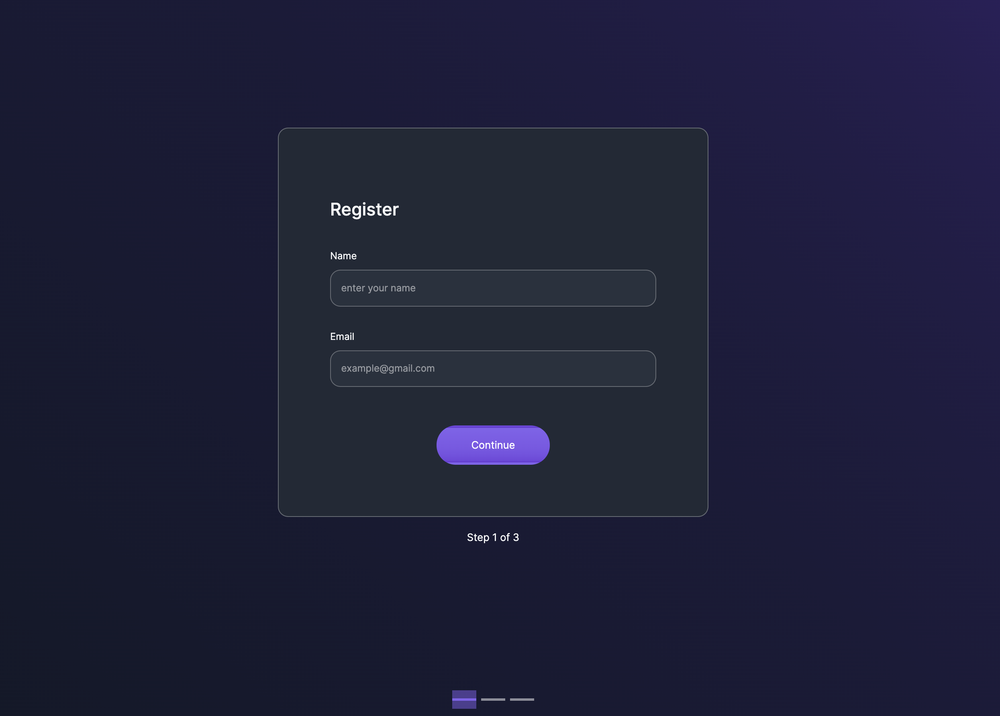
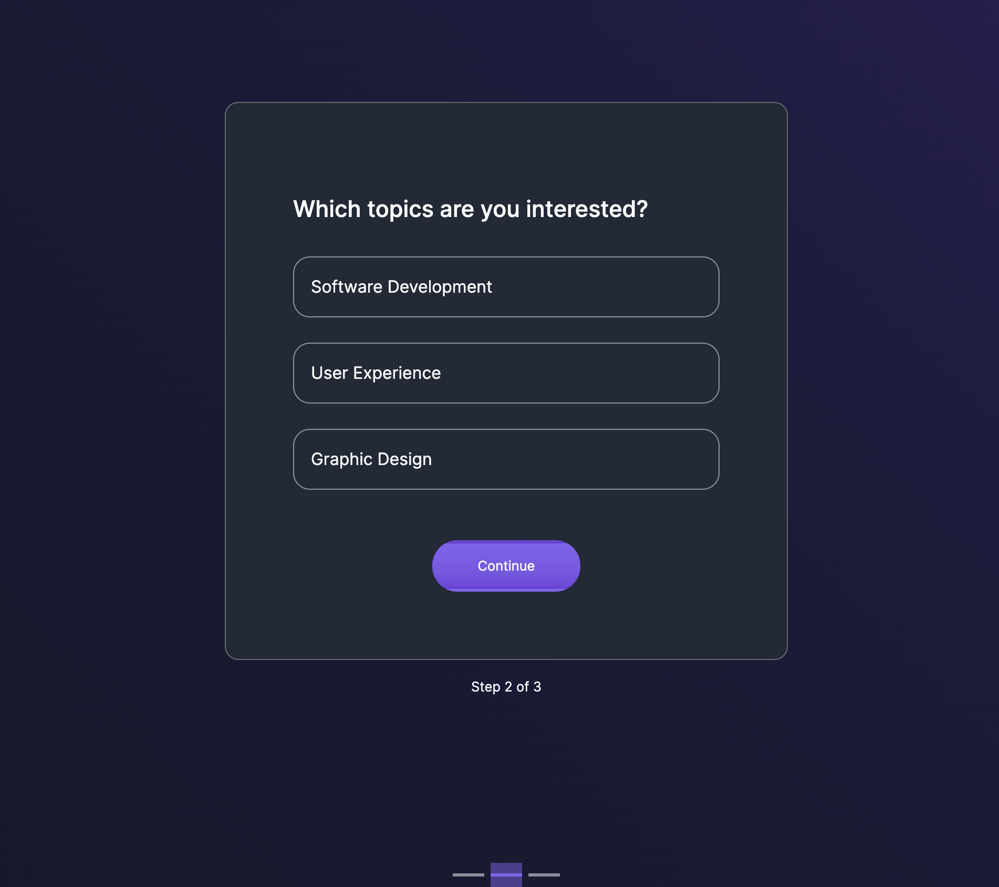

# Read me
This is an exercise to resolve a given challenge using a form divide in three steps:
- Enter basic personal data
- Select topics from a list
- Verify data and send it to the server

On the server side the data is received, validaded, processed and stored at the database.

## Front
We have, as mentioned beafore, a form divided in three steps. First with basic personal information:

Second where the user select at least one topic:

